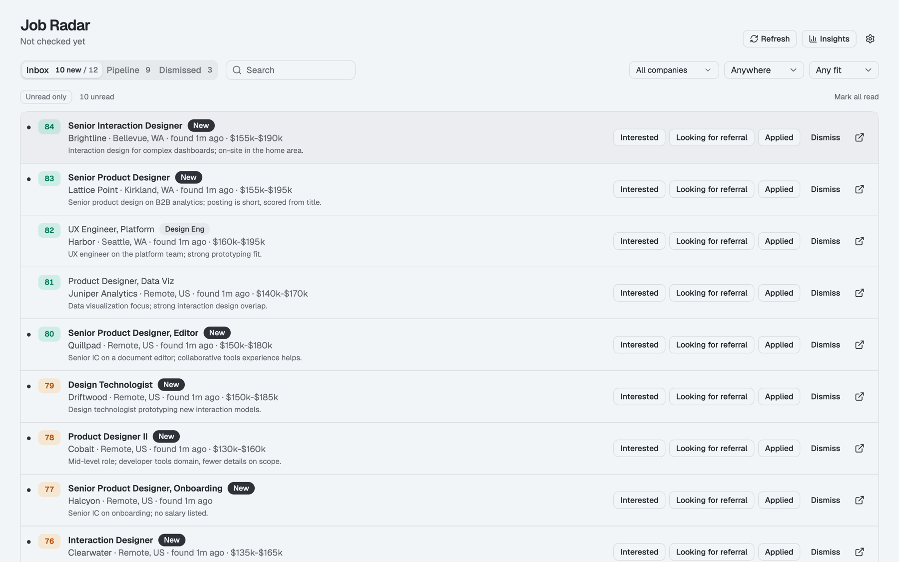
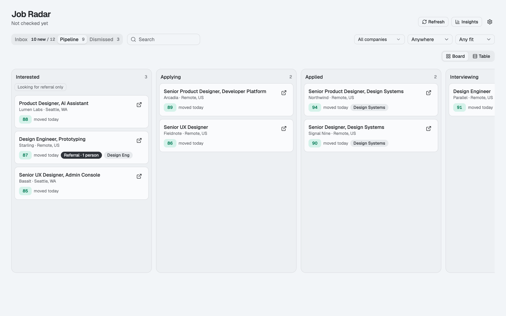
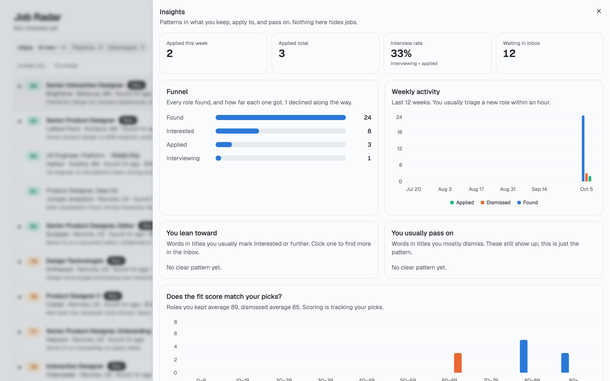

# Job Radar

A personal job search that runs itself. Every morning it checks the companies you care about, plus LinkedIn, for new roles that fit you. Each role gets a fit score against your background, and a local dashboard lets you triage them with the keyboard and track where every application stands.

Everything runs on your own machine. There's no account, no cloud service, and no API keys. Claude does the browsing and scoring through your existing Claude Code or Claude desktop app.



## What it does

- **Finds roles at the companies you choose.** You give it your list during setup. Job boards on Greenhouse, Ashby, Lever, Workday, Eightfold, Amazon and Google-hosted (Jibe) are read directly by script in seconds. For careers sites without a feed, and for a LinkedIn catch-all search, Claude browses them in your browser (read-only).
- **Filters to what fits.** Title include and exclude rules, the levels you target, and your locations: one or more metro areas, remote, and remote-in-the-US only.
- **Scores every role.** You get an instant rules-based score first. Then Claude writes a considered 0–100 fit score and a one-line reason, judged against your profile.
- **Fast triage.** In the Inbox, move with `j`/`k` and press `i` for interested, `a` for applied, `x` to dismiss. Unread roles are marked New.
- **Pipeline board.** Drag cards across Interested → Applying → Applied → Interviewing, and reorder them within a column. A table view is also available.
- **Referrals.** Flag a role as "looking for referral", then track each person you reach out to (found, messaged, replied, referred).
- **Insights.** See your funnel, weekly activity, the title words you lean toward or pass on, and whether the fit score matches your picks.

| Pipeline | Insights |
|---|---|
|  |  |

## Setup

You need a Mac or Linux machine, about 10 minutes, and Claude Code (the [Claude desktop app](https://claude.ai/download) Code tab, or the `claude` CLI).

**1. Install Node 24 or newer and pnpm.** Download Node from [nodejs.org](https://nodejs.org), then turn on pnpm:

```bash
corepack enable
```

**2. Copy this repo's link.** On this GitHub page, click the green **Code** button and copy the HTTPS URL:

```
https://github.com/jgiambrajr-stack/Job-Radar.git
```

**3. Clone it.** In a terminal, run:

```bash
git clone https://github.com/jgiambrajr-stack/Job-Radar.git
```

Or skip the terminal: in Claude Code, paste the link and say "clone this repo".

**4. Open the folder in Claude Code.** In the desktop app, choose the `Job-Radar` folder. In a terminal, run `claude` inside it.

**5. Say "set up Job Radar".** Claude installs everything and interviews you, all in one message:
- your background (paste a resume or your LinkedIn About section)
- the titles you want, and look-alike titles to skip
- your level
- your location(s), and whether remote counts
- domains you care about
- the companies you want to track (Claude can suggest some if you don't have a list)
- whether you want the LinkedIn search

**6. Answer the questions.** Claude writes your config, adds your companies, and runs the first scan.

**7. Open the dashboard.**

```bash
pnpm today
```

On a Mac you can also double-click `Job Radar.command`. The dashboard opens at http://localhost:4321.

**8. Optional: make it daily.** Ask Claude to create the **Job Radar daily** scheduled task, which runs every weekday morning in the Claude desktop app. For the LinkedIn search, connect [Claude in Chrome](https://claude.ai/chrome) in a Chrome window where you're logged in to LinkedIn.

> **No API keys needed.** Job boards are read through their public feeds, and everything Claude does runs in your own Claude session.

### Setting up without an agent
Run `pnpm install` and `pnpm build`. Then edit the files in `config/` yourself (`scoring.json`, `criteria.json`, `companies.json`, `linkedin.json`). [SETUP.md](SETUP.md) describes every field. Then run `pnpm scan` and `pnpm today`.

## Daily use

1. New roles arrive each morning from the scheduled task. Click **Refresh** in the dashboard to check on demand: feeds take seconds, then a background Claude run handles LinkedIn and scoring (a few minutes, logged to `data/sweep.log`).
2. Triage the **Inbox**:

| Key | Action |
|---|---|
| `j` / `k` | Next / previous role |
| `Enter` | Open details |
| `o` | Open the posting |
| `i` | Interested |
| `r` | Looking for referral |
| `a` | Applied |
| `x` | Dismiss (it won't come back) |
| `u` | Toggle read / unread |

3. Track everything else on the **Pipeline** board.

## How it works

```
company feeds ──(pnpm scan, by script)──────────────┐
                                                    ├─▶ filters ─▶ data/jobs.db ─▶ dashboard
sites without feeds + LinkedIn ──(Claude browses)──▶ data/inbox/*.json ──(pnpm ingest)┘
                                                                     │
                                         rules score instantly, then Claude scores fit
```

| Command | What it does |
|---|---|
| `pnpm today` | Build if needed, start the server, and open the dashboard. The server stops on its own about 2 minutes after you close the tab. |
| `pnpm scan` | Check every company feed now |
| `pnpm ingest` | Import what Claude collected in `data/inbox/` |
| `pnpm summary` | One-line summary of the latest run |
| `pnpm dev` | UI dev server with hot reload |

The stack is Node 24 (built-in `node:sqlite`, TypeScript run directly), Hono, React, Vite, and shadcn/ui. The Claude routine prompts are in `routine/`.

## Customizing

- **Settings → Scoring**: your profile, points per role and level, and the guidance Claude follows when scoring.
- **Settings → Locations**: your areas and remote rules, with a preview of how any location string is judged.
- **Companies → Add company**: paste a careers URL. Supported job boards are detected and read by script, and anything else is browsed by Claude.
- **`config/criteria.json`**: title include and exclude rules, and badge tags.

The repo ships with no companies. Your list comes from the setup interview, and you can add or remove companies any time in the Companies view. The title and scoring rules start as an example for product and UX design roles, and setup replaces them with yours.

## Privacy

Your jobs, notes and pipeline live only in `data/jobs.db` on your machine, which git ignores. Back it up by copying the file. Claude's browsing is read-only: it never applies, messages, follows, signs in, or accepts anything on your behalf.

## License

[MIT](LICENSE)
